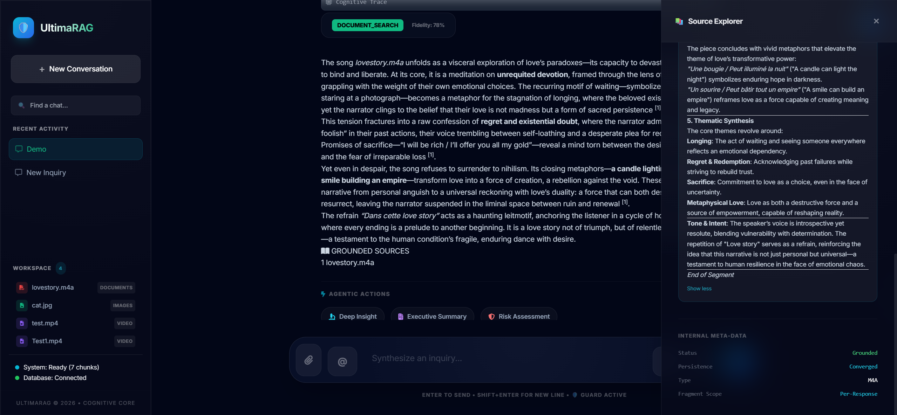
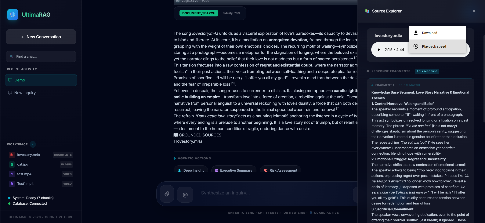

# SpandaOS Audio Processing Workflow

This document provides a detailed, professional overview of the audio processing capabilities within SpandaOS. It outlines the step-by-step lifecycle of an audio file, from initial ingestion and intelligence extraction to final synthetic understanding and interactive source exploration.

## Step 1: Audio Selection, File Hashing, and Query
To initiate the audio processing workflow, **we must select and upload an audio file and ask a query alongside the media upload.** This gives the system not just the audio, but the direction for its reasoning. Instantly upon upload, the underlying `MultimodalManager` computes a strict SHA-256 hash to enforce **Intelligent Caching**. If this exact audio asset was previously processed in your current session, SpandaOS immediately pulls the high-fidelity cached insights, bypassing heavy re-computation entirely.


## Step 2: High-Speed Transcription & Background Enrichment
Once uploaded, **the system will detect the audio file and start extracting meaningful insights.** 
The pipeline begins with the `Faster-Whisper` model, executing a high-speed, local CPU-bound transcription. It performs high-fidelity decoding (using a beam size of 5) to precisely align speech with timestamp segments. 
These extracted insights get instantly delivered to the `'Qwen3:8B'` narrative LLM as an asynchronous **Background Task** for deep enrichment. The enricher model takes the raw transcription timestamps and synthesizes them into a highly cohesive, cinematic "Intelligence Dossier."


## Step 3: Knowledge Base Storage & RAG Context Retrieval
**Once enrichment gets done and the audio-related textual data gets stored in the knowledge base, the application starts processing the user query with the RAG (Retrieval-Augmented Generation) flow.** By securely indexing the polished audio dossier into our vector database, spoken conversations essentially transform into highly searchable paragraphs of text. 
**Based on the user query, the RAG flow scrapes the related context and delivers it to the Synthesizer model to generate a proper response.** The RAG semantic search engine surfaces the exact moments and transcriptions from the audio file necessary to perfectly address the prompt.


## Step 4: Verification by Critic & Healing Agent
**Once the synthesizer finishes producing the response, the Critic and Healing agent checks and verifies whether the response is proper or not, and fills any missing gaps.** This is the crucial metacognitive layer. It actively cross-references the synthesizer's draft against the retrieved transcription chunks to guarantee the system hasn't hallucinated and that the response remains 100% faithful to the original recording.


## Step 5: Final Response & Grounded Sources UI
**Once a detailed response gets generated, we will get the audio name listed below "Grounded Sources". If we click on the file name, the audio will get loaded into the source explorer.** This conversational traceability standard provides users absolute transparency, allowing them to pinpoint the precise audio asset that informed the AI's logic.


## Step 6: Source Explorer & Evidence Tracking
**In the source explorer page, the audio will get rendered, and all the extracted insights from the audio will be written in the fragments (chunks) which were responsible for the generation of the proper response.** This side-by-side view empowers users to listen to the audio track while simultaneously reading the exact semantic intelligence segments the AI leveraged to answer the query.



## Step 7: Internal Meta-Data Review & Media Download
**At the end of the file, internal meta-data related to the file will be written. The user can download this media as well.** System-level parameters such as transcript segment counts, execution timestamps, locking states, and vector indexing metadata are surfaced for advanced auditing. The interface also preserves access to the original source file, allowing secure download and external archiving at any time.



---

## Detailed Audio Processing Architecture Flow

The following Mermaid.js diagram provides an extremely detailed visualization of the physical SpandaOS audio processing infrastructure, tracking the data flow from Whisper transcription through asynchronous Qwen extraction and finally rendering in the user interface.

```mermaid
graph TD
    classDef user fill:#e3f2fd,stroke:#1565c0,stroke-width:2px;
    classDef process fill:#f3e5f5,stroke:#4a148c,stroke-width:2px;
    classDef model fill:#fff3e0,stroke:#e65100,stroke-width:2px;
    classDef storage fill:#e8f5e9,stroke:#2e7d32,stroke-width:2px;
    classDef ui fill:#fce4ec,stroke:#c2185b,stroke-width:2px;
    classDef bg fill:#fffde7,stroke:#fbc02d,stroke-width:2px;

    %% User Interaction & Ingestion Phase
    A[User Uploads Audio & Submits Query]:::user --> B{System Hash / Caching Layer}:::process
    B -->|Hash Exists in Session| C[Return Cached Audio Dossier]:::storage
    B -->|New Audio Track| D{Audio Processing Node}:::process
    
    %% Whisper Transcription Pipeline
    D --> E[Faster-Whisper Model<br>CPU Int8 / Beam Size 5]:::model
    E -->|High-Fidelity Decoding| F[Raw Timestamped Segments]:::storage
    
    %% Structured Formatting
    F --> G[Context Builder]:::process
    G --> |Format: \[MM:SS\] SPEECH: Text| H[Structured Audio Transcript]:::storage
    
    %% Asynchronous Background Enrichment Phase
    H --> I>Trigger Asynchronous Background Task]:::bg
    I --> J[Qwen3:8B Narrative Enricher Model]:::model
    J --> |Synthesizes Audio Intelligence| K[Enriched Audio Dossier]:::storage
    
    %% Vector Storage Phase
    K --> L[(Vector Storage Indexed)]:::storage
    
    %% Retrieval & Generation (RAG) Phase
    L --> |Activated by User Query| M[RAG Semantic Matcher]:::process
    M --> |Inject Audio Chunks as Context| N[Synthesizer Model]:::model
    
    %% Metacognitive Validation Phase
    N --> |Draft Formulation| O[Critic Node: Fact Check]:::model
    O -->|Hallucination Detected?| P[Healing Agent: Correct Draft]:::model
    P --> Q
    O -->|Output Validated| Q[Final Response Formulation]:::process
    
    %% UI Presentation Phase
    Q --> R[Chat UI: Render Final Response]:::ui
    Q --> S[Chat UI: Render Grounded Sources]:::ui
    
    S -.-> |User clicks Audio Pill| T[Source Explorer Side-Panel]:::ui
    T --> U[Render Interactive Audio Player]:::ui
    T --> V[Display Intelligence Transcript Chunks]:::ui
    T --> W[Expose Technical Meta-Data & Segments Count]:::ui
    T --> X[Provide Media Download Capability]:::ui
```
