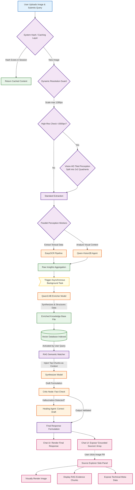

# SpandaOS Image Processing Workflow

This document provides a detailed, professional overview of the image processing capabilities within SpandaOS. It outlines the step-by-step lifecycle of an image, from the initial user upload through intelligent extraction, background enrichment, and comprehensive source exploration.

## Step 1: Image Selection, File Hashing, and Query
To initiate the image processing workflow, **we must select and upload an image and ask a query alongside the media upload**. This dual-input approach provides the system with both the visual context and your specific objective. Under the hood, the system immediately calculates a strict SHA-256 hash to apply **Intelligent Caching**—if the same file was previously processed in the current session, the system instantly bypasses heavy compute and loads the cached data.

## Step 2: Dynamic Pre-processing, OCR, and Vision-HD Extraction
Once uploaded, **the system will detect the image file and start extracting meaningful insights from the image.** SpandaOS employs a robust, VRAM-optimized dual-model pipeline:
- **Dynamic Resolution Guard:** The image is safely scaled to a maximum of 1280px to optimize processing time.
- **Vision-HD Tiled Perception (SOTA):** If the original image exceeds 2000px, the system dynamically slices the image into a 2x2 grid (4 quadrants) and processes them sequentially, preserving extreme high-fidelity detail.
- **Extraction:** A simple **OCR Model** extracts all raw textual data, while the **Qwen-Vision2B Model** comprehensively analyzes the non-textual layout and visual context.

## Step 3: Asynchronous Data Enrichment via Qwen3:4B
**Once the proper processing by the OCR and Qwen models gets finished, these extracted insights get delivered to the 'Qwen3:4B' model for enrichment.** This step is handled natively as an **Asynchronous Background Task**. This multi-modal reasoning engine merges the raw optical text with Semantic visual descriptions, structuring and refining the data into a high-fidelity narrative without permanently blocking the active UI thread.

## Step 4: Knowledge Base Storage & RAG Initiation
**Once enrichment gets done and the image-related textual data gets stored in the knowledge base, the application starts processing the user query with the RAG (Retrieval-Augmented Generation) flow.** By securely indexing the enriched textual dossiers into our vector database, the originally unstructured image essentially transforms into a highly searchable repository of knowledge ready for semantic matching.

## Step 5: Context Retrieval & Synthesizer Generation
**Based on the user query, the RAG flow scrapes the related context from the knowledge base and delivers it to the Synthesizer model to generate a proper response.** The semantic search engine locates the exact informational fragments (chunks) required from the newly enriched image data, passing them as explicit context variables to guarantee accuracy over general AI knowledge.

## Step 6: Verification by Critic & Healing Agent
**Once the synthesizer finishes producing the response, the Critic and Healing agent checks and verifies whether the response is proper or not, and fills any missing gaps.** This metacognitive verification layer strictly compares the generated draft against the retrieved source chunks. It actively identifies hallucinations and injects corrected facts, ensuring unquestionable factual integrity.

## Step 7: Final Response & Grounded Sources UI
**Once a detailed response gets generated, we will get the image name listed below "Grounded Sources". If we click on the file name, the image will get loaded into the source explorer.** This conversational traceability standard allows users to pinpoint the exact media asset that influenced the respective AI-generated answer.

## Step 8: Source Explorer & Evidence Tracking
**In the source explorer page, the image will get rendered, and all the extracted insights from the image will be written in the fragments (chunks) which were responsible for the generation of the proper response.** This transparent, side-by-side view empowers users to manually cross-reference the AI's semantic understanding against the raw visual data on screen.

## Step 9: Internal Meta-Data Review
**At the end of the file, internal meta-data related to the file will be written.** This crucial feature exposes system internal parameters such as vector indexing identifiers, ingestion timestamps, locking states, and file-categorization hashes, providing complete technical transparency for advanced users.

---

## Detailed Image Processing Architecture Flow

The following Mermaid.js diagram provides an extremely detailed, logically verified visualization of the physical SpandaOS image processing infrastructure, capturing the VRAM guards, asynchronous enrichment, and strict routing logic.

