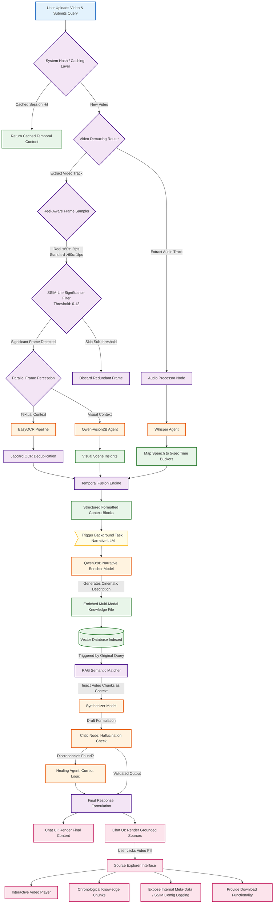

# SpandaOS Video Processing Workflow

This document provides a detailed, professional overview of the video processing capabilities within SpandaOS. It outlines the step-by-step lifecycle of a video file, from initial ingestion and multi-modal extraction to temporal narrative synthesis and interactive source exploration.

## Step 1: Video Selection, File Hashing, and Query
To initiate the video processing workflow, **we must select and upload a video and ask a query alongside the media upload**. This provides SpandaOS with both the temporal visual context and your specific objective. The system immediately calculates a strict SHA-256 hash to apply **Intelligent Caching**. If the exact video has already been processed within the current session, it instantly loads the cached data to bypass heavy computational stages.

## Step 2: Multi-Modal Extraction (Audio, Text, Vision)
Once uploaded, **the system will detect the video file and start extracting meaningful insights.** The video is intelligently decomposed into its core components—frames and audio—using a highly optimized pipeline:
- **Audio Processing:** A `Whisper` model creates a highly accurate transcription of the audio, automatically aligned into 5-second time buckets.
- **Dynamic Frame Sampling:** SpandaOS applies Reel-aware logic (sampling at 2fps for videos ≤60s, and 1fps for longer videos). An SSIM-lite filter ensures only visually significant "key-frames" are processed.
- **Visual Perception:** Both an EasyOCR model (to extract all embedded textual data) and the `Qwen-Vision2B` model (to describe the visual scene) run simultaneously on the significant frames.

## Step 3: Temporal Fusion and Narrative Enrichment (Qwen3:8B)
**Once the proper processing by OCR, Qwen, and Whisper models gets finished, these extracted insights get delivered to the 'Qwen3:8B' model for enrichment.** The system first performs *Temporal Fusion*, aligning the Whisper transcript, de-duplicated OCR text, and Qwen-Vision scene concepts into chronological "Structured Context" blocks. This fused data is then fed as a Background Task to the heavy narrative LLM to generate a rich, humanized cinematic description of the entire video.

## Step 4: Knowledge Base Storage & RAG Initiation
**Once enrichment gets done and the video-related textual data gets stored in the knowledge base, the application starts processing the user query with the RAG (Retrieval-Augmented Generation) flow.** By securely indexing the enriched temporal dossier into our vector database, the originally unstructured video file transforms into a searchable repository of actionable intelligence.

## Step 5: Context Retrieval & Synthesizer Generation
**Based on the user query, the RAG flow scrapes the relevant context from the knowledge base and delivers it to the Synthesizer model to generate a proper response.** The RAG semantic search engine locates the exact chronological fragments from the video—whether spoken, seen, or read on-screen—that hold the answer, ensuring the synthesizer relies purely on grounded evidence.

## Step 6: Verification by Critic & Healing Agent
**Once the synthesizer finishes producing the response, the Critic and Healing agent checks and verifies whether the response is proper or not, and fills any missing gaps.** This metacognitive verification step strictly evaluates the drafted response against the retrieved video chunks to detect hallucinations, correct logical misalignments, and guarantee unquestionable factual integrity.

## Step 7: Final Response & Grounded Sources UI
**Once a detailed response gets generated, we will get the video name listed below "Grounded Sources". If we click on the file name, the video will get loaded into the source explorer.** This provides ultimate conversational traceability, allowing the user to trace any specific piece of technical guidance directly back to its originating media file.

## Step 8: Source Explorer & Evidence Tracking
**In the source explorer page, the video will get rendered, and all the extracted insights from the video will be written in the fragments (chunks) which were responsible for the generation of the proper response.** Users can play the video back alongside the highly detailed semantic breakdown, bridging the gap between raw media and system-generated logic.

## Step 9: Internal Meta-Data Review
**At the end of the file, internal meta-data related to the file will be written.** This provides advanced users and administrators with complete technical transparency, surfacing deep-system intelligence like frame-sampling rates, SSIM differentials, active temporal buckets, vector index hashes, and ingestion parameters.

## Step 10: Media Download Capability
**The user can download this media as well.** From the interface, the original uploaded asset remains highly accessible, allowing for quick retrieval to external local environments without losing the AI-augmented context.

---

## Detailed Video Processing Architecture Flow

The following Mermaid.js diagram provides an extremely detailed visualization of the physical SpandaOS video processing infrastructure, illustrating the temporal fusion of audio and visual streams up through final UI rendering.

